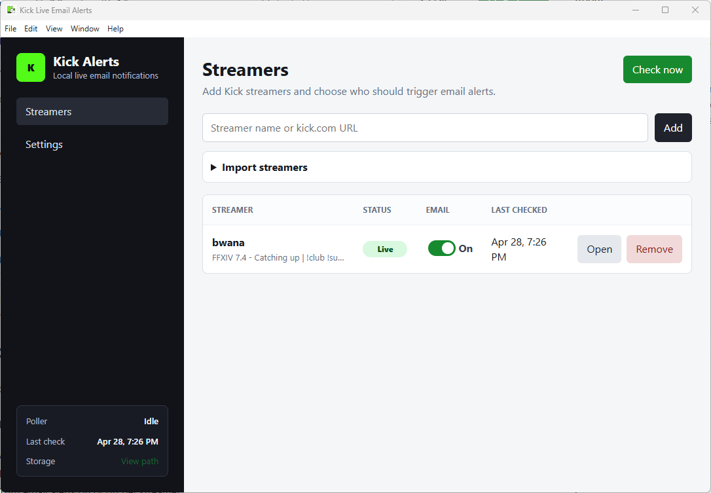
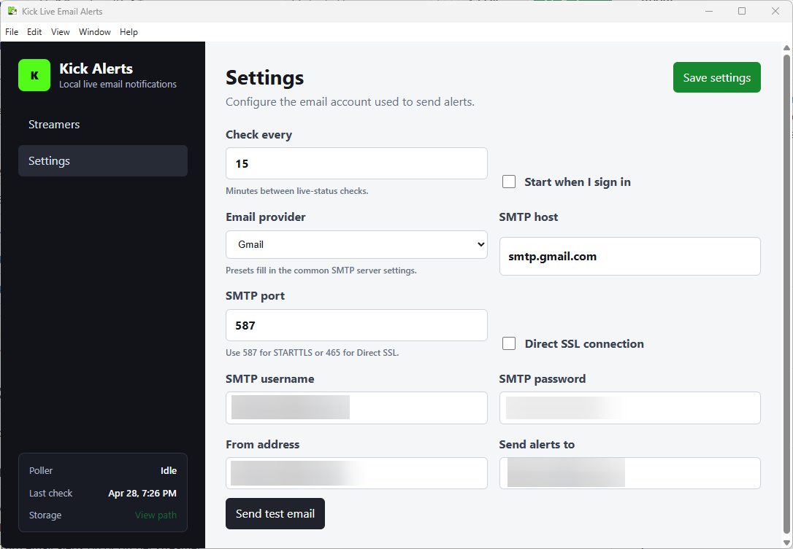

# Kick Live Email Alerts

A local Electron app that runs in the background and sends email when selected Kick streamers go live.

> [!IMPORTANT]
> **Gmail users usually need an App Password, not their normal account password.**





## Features

- Add streamers by Kick username/slug.
- Paste or import a list of streamers.
- Turn email alerts on or off per streamer.
- Store all data locally on your computer.
- Run from the system tray/menu bar.
- Send email through your own SMTP account.

## Development

1. Install dependencies:

   ```powershell
   npm install
   ```

2. Start the app:

   ```powershell
   npm start
   ```

3. Open Settings and configure SMTP.

## Building Installers

This project uses Electron Builder.

Build a Windows installer EXE on Windows:

```powershell
npm run dist:win
```

Build a macOS DMG on macOS:

```bash
npm run dist:mac
```

Build a Linux AppImage on Linux:

```bash
npm run dist:linux
```

Build the default package for the current platform:

```bash
npm run dist
```

Packaged files are written to `dist/`.

Cross-platform note: build each installer on its matching operating system for the most reliable results. Windows EXE builds should be made on Windows, macOS DMG builds on macOS, and Linux AppImage builds on Linux.

## Mac Installation Note

If you see **"Kick Live Email Alerts is damaged and can't be opened"** when launching on macOS, this is usually Gatekeeper blocking an unsigned app.

1. Move the app to `/Applications` first.
2. Open Terminal and run:

```bash
xattr -cr "/Applications/Kick Live Email Alerts.app"
```

3. Open the app again.

If macOS still blocks launch, open **System Settings > Privacy & Security** and click **Open Anyway** (if shown).

## Notes

Kick does not currently offer a clean public "import everyone I follow" endpoint for regular users, so this app supports paste/import instead. The app checks Kick periodically and sends one email when a streamer changes from offline to live.
